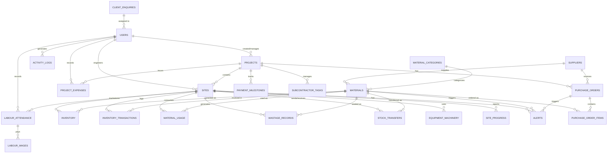

# Entity Relationship Diagram

This document contains the ER diagram for the Material Inventory Management System database, including the newly added modules for Site Management, Financials, and Labour.

